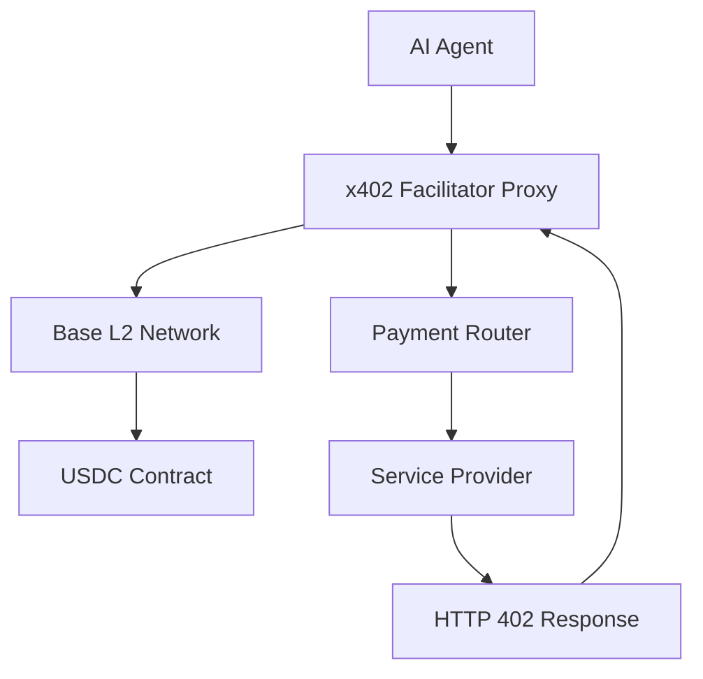

<div align="center">

# 🕶️ Awesome x402

### Machine-to-Machine Payment Protocols & Agent Commerce

[](https://opensource.org/licenses/MIT)
[](https://base.org)
[](https://www.centre.io/usdc)
[](https://github.com)
[](https://github.com/seob5285-alt/awesome-x402/graphs/contributors)

</div>

---

## 🎯 Overview

A **comprehensive collection** of resources, tools, and infrastructure for implementing autonomous AI agent payment systems using the **x402 protocol**. This repository serves as the definitive hub for developers building machine-to-machine commerce applications on **Base L2** with **USDC** settlements.

> **🚀 Revolutionary Concept**: Enable AI agents to autonomously handle payments without human intervention, creating a new paradigm for machine-to-machine commerce.

---

## 🔥 What is x402?

The **x402 protocol** enables autonomous AI Agents (LangChain, CrewAI, Auto-GPT, and other frameworks) to seamlessly handle HTTP 402 Payment Required responses by automatically clearing payment gates using Base L2 USDC splits.

### 🎨 Key Capabilities

| Feature | Description |
|---------|-------------|
| 🤖 **Autonomous Payments** | AI agents pay for API access without human intervention |
| ⚡ **Micro-transactions** | Execute tiny payments for premium services and data feeds |
| 🏪 **Decentralized Markets** | Participate in marketplaces with native payment capabilities |
| 🔗 **Agent Commerce** | Scale agent-to-agent commerce through programmable money flows |

---

## 🏗️ Core Architecture

<div align="center">



</div>

### 🔗 Primary Repository

**[x402-facilitator-proxy](https://github.com/seob5285-alt/x402-facilitator-proxy)**

The core payment facilitation proxy handling:
- 🔄 HTTP 402 response interception and processing
- 💰 Base L2 USDC transaction orchestration
- 🔐 Agent authentication and authorization
- 🎯 Payment routing and settlement logic

---

## 📦 Ecosystem Components

### 🖥️ Model Context Protocol (MCP) Servers

<div align="center">

| Component | Description | Status |
|-----------|-------------|---------|
| **x402-mcp-server** | Native MCP integration for payment-aware AI agents | ✅ Active |
| **base-usdc-mcp** | Base L2 USDC balance and transaction management | ✅ Active |
| **agent-wallet-mcp** | Secure wallet management for autonomous agents | 🔄 Development |
| **payment-router-mcp** | Smart routing for multi-destination payments | 🔄 Development |

</div>

### 🐍 Python Framework Boilerplates

```python
# Quick Integration Example
from x402_mcp import X402MCPServer

server = X402MCPServer(
    base_rpc_url="https://mainnet.base.org",
    wallet_private_key=os.getenv("MCP_WALLET_KEY")
)

@server.tool()
async def paid_api_call(url: str, max_payment_usdc: float) -> dict:
    """Make a paid API call with automatic x402 handling"""
    return await server.execute_paid_request(url, max_payment_usdc)
```

| Framework | Repository | Language |
|-----------|------------|----------|
| **LangChain x402** | `langchain-x402-template` | 🐍 Python |
| **CrewAI Payments** | `crewai-payment-agents` | 🐍 Python |
| **Auto-GPT Plugin** | `autogpt-x402-plugin` | 🐍 Python |

### 🟨 TypeScript/JavaScript Implementations

```typescript
// Agent Payment Setup
import { X402Agent } from 'x402-agent-sdk';

const agent = new X402Agent({
  walletPrivateKey: process.env.AGENT_WALLET_KEY,
  baseRpcUrl: 'https://mainnet.base.org',
  usdcContractAddress: '0x833589fCD6eDb6E08f4c7C32d4f71b54bda02913'
});

// Agent automatically handles 402 responses
const response = await agent.fetchWithPayment('https://api.premium-service.com/data');
```

| Framework | Repository | Runtime |
|-----------|------------|---------|
| **TypeScript SDK** | `ts-agent-x402-starter` | 🟨 Node.js |
| **Node.js SDK** | `nodejs-x402-sdk` | 🟨 Node.js |
| **Deno Agents** | `deno-agent-payments` | 🦕 Deno |

### 🛡️ Edge Tollbooth Guards & Middleware

<div align="center">

| Platform | Middleware | Performance |
|----------|------------|-------------|
| **Express.js** | `express-x402-middleware` | ⚡ High |
| **FastAPI** | `fastapi-payment-guard` | ⚡ High |
| **Nginx** | `nginx-x402-module` | 🚀 Ultra |
| **Cloudflare** | `cloudflare-worker-x402` | 🌐 Edge |
| **Vercel** | `vercel-edge-payments` | 🌐 Edge |

</div>

---

## 🛠️ Developer Tools

### 🔍 Testing & Monitoring

<div align="center">

| Tool | Purpose | Status |
|------|---------|--------|
| 🚰 **Testnet Faucet** | Base testnet USDC for development | ✅ Live |
| 🐛 **Payment Debugger** | Visual debugging for payment flows | ✅ Live |
| 📊 **Analytics Dashboard** | Real-time payment monitoring | 🔄 Beta |

</div>

### 🔒 Security & Compliance

- **🔐 x402-audit-toolkit** - Security auditing tools for payment integrations
- **✅ compliance-checker** - Regulatory compliance validation utilities
- **🕵️ payment-forensics** - Transaction analysis and dispute resolution

---

## 🚀 Quick Start

### 1️⃣ Clone the Core Integration Suite

```bash
git clone https://github.com/seob5285-alt/x402-facilitator-proxy.git
cd x402-facilitator-proxy
```

### 2️⃣ Boot up the Local MCP Server Layer

```bash
cd x402-client-sdk
npm install
npm run mcp:start
```

### 3️⃣ Configure Your Agent

```bash
# Set up environment variables
echo "AGENT_WALLET_KEY=your_private_key" >> .env
echo "BASE_RPC_URL=https://mainnet.base.org" >> .env
echo "USDC_CONTRACT=0x833589fcd6edb6e08f4c7c32d4f71b54bda02913" >> .env
```

---

## 💡 Use Cases

<div align="center">

### 🎯 Real-World Applications

</div>

| Use Case | Description | Market Size |
|----------|-------------|-------------|
| 🔬 **AI Research Agents** | Autonomous data collection from premium APIs | $2.3B |
| 📈 **Trading Bots** | Real-time market data access with micro-payments | $11.1B |
| 📰 **Content Aggregators** | Paid access to premium news and analysis feeds | $4.7B |
| 🤝 **Multi-Agent Systems** | Agent-to-agent service marketplace transactions | $8.2B |
| 🌐 **IoT Device Networks** | Machine-to-machine payments for sensor data | $12.6B |
| ⚡ **Computational Markets** | On-demand GPU/CPU resource purchasing | $6.8B |

---

## 🤝 Contributing

<div align="center">

**We welcome contributions to the x402 ecosystem!**

[](CONTRIBUTING.md)

</div>

### 📋 How to Contribute

- 🆕 **Submit new resource listings**
- 🐛 **Report bugs and security vulnerabilities**
- 💡 **Propose protocol improvements**
- 🔗 **Add framework integrations**

### 📝 Guidelines

Please see our **[Contributing Guide](CONTRIBUTING.md)** for detailed information on our development process, coding standards, and submission guidelines.

---

## 📄 License

<div align="center">

This project is licensed under the **MIT License** - see the [LICENSE](LICENSE) file for details.

[](https://opensource.org/licenses/MIT)

</div>

---

## 📡 Live Network Signals

<div align="center">

**🔴 LIVE** | Auto-indexed payment nodes on Base L2

</div>

> **🤖 Automated Section**: This section is automatically updated by the [`signal-finder.ts`](src/signal-finder.ts) scanner to track active payment nodes on Base L2.

### 📊 Network Statistics

| Metric | Value | Trend |
|--------|-------|-------|
| Active Nodes | `loading...` | 📈 |
| Total Volume | `loading...` | 📈 |
| Success Rate | `loading...` | ✅ |
| Avg Response Time | `loading...` | ⚡ |

---

<div align="center">

### 🌟 Star this repository if you find it useful!

[](https://github.com/seob5285-alt/awesome-x402/stargazers)

**Made with ❤️ by the x402 Community**

</div>
